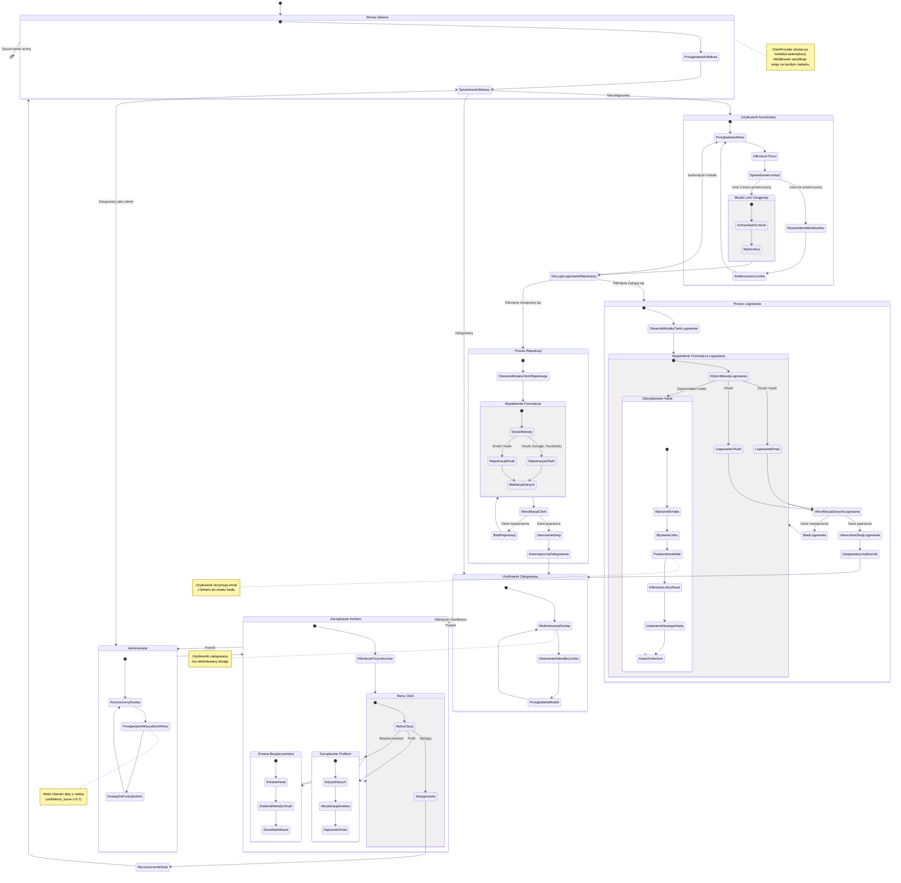

# Diagram Podróży Użytkownika - Moduł Autentykacji i Dostępu

Ten diagram przedstawia kompletną podróż użytkownika w aplikacji "Co się dzieje
w Polsce", uwzględniając proces autentykacji, ograniczenia dostępu oraz
subskrypcję.

## Kluczowe Elementy Podróży

### 1. Użytkownik Anonimowy

- **Limit:** 3 otwarcia treści aktów prawnych (weryfikacja `localStorage`)
- **Akcja po przekroczeniu:** Modal z przyciskami "Zaloguj się" i "Zarejestruj
  się"

### 2. Proces Rejestracji i Logowania

- **Provider:** Clerk obsługuje całą logikę autentykacji
- **Metody:** Email/hasło oraz OAuth (Google, Facebook)
- **Komponenty:** `SignInButton`, `SignUpButton` w `AuthButtons.tsx`
- **Modale:** Gotowe komponenty Clerk z walidacją

### 3. Użytkownik Zalogowany

- **Dostęp:** Nielimitowany dostęp do wszystkich treści

### 4. Administrator

- **Role:** Weryfikacja przez `user?.publicMetadata?.role === 'admin'`
- **Dodatkowe uprawnienia:** Widzi akty o `confidence_score < 0.7`

### 5. Zarządzanie Kontem

- **Komponent:** `UserButton` z Clerk
- **Funkcje:** Edycja profilu, zmiana hasła, wylogowanie

## Techniczne Detale Implementacji

### Hooki i Komponenty

- **`useModalLimit(limit)`**: Zarządza licznikiem otwarć w `localStorage` dla
  gości
- **`useUser()`**: Hook Clerk do dostępu do danych użytkownika
- **`useIsAdmin()`**: Helper do sprawdzania roli administratora
- **`ClerkProvider`**: Kontekst autentykacji w `layout.tsx`
- **`clerkMiddleware`**: Weryfikacja sesji w `middleware.ts`

### API Endpoints

- **`/api/admin/update-act`**: Chroniony endpoint dla adminów

### Stan i Zarządzanie

- **localStorage**: `modalOpens` - licznik otwarć dla gości
- **Clerk Metadata**:
  - `publicMetadata.role` - rola użytkownika
